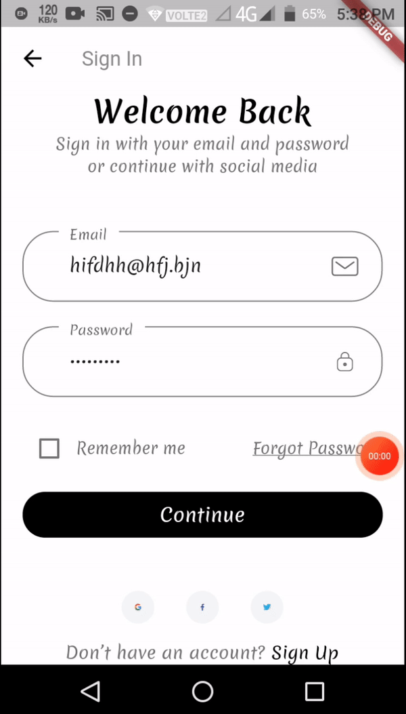
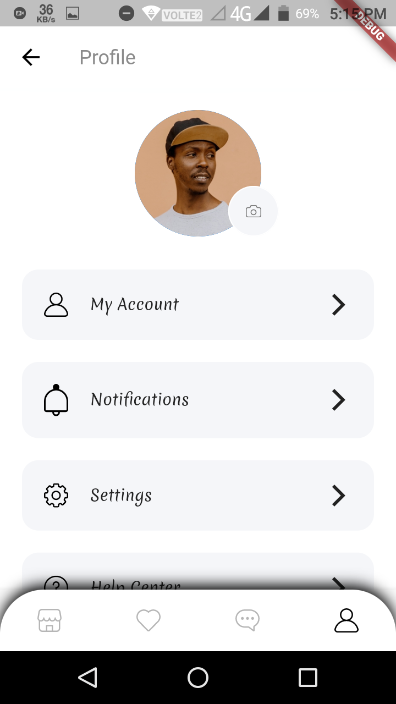
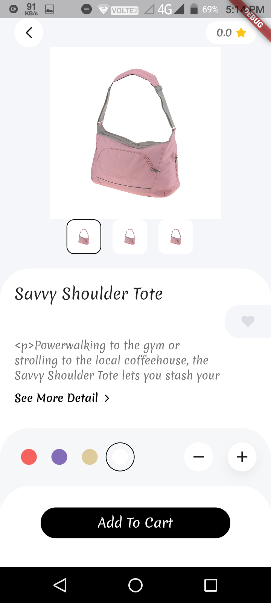

<h1 align="center">
   
  
   
  Open source Flutter mobile app for Magento 2
   
</h1>

Magento Mobile Oss is a fully functional eCommerce App for your Magento 2 website. It uses [Magento 2 REST API](https://devdocs.magento.com/guides/v2.3/get-started/rest_front.html), to dispaly catalog, products, add products to cart, place an order and much more.

## 📣 Annoncement

I have been busy at the moment although PRs are welcome, don't shy away to do pull requests. 
If you like it please consider giving it a star.

## 📲 Setup

Follow the [Documentation](https://docs.flutter.dev/get-started/install) to install flutter. Fork and clone project on your machine to setup project locally and run the project.

## 🎨  Editing

Modify <b>Base url, App Name, Api Token</b> in config.dart file.

## 🎬 Demo

  

## 📲 Demo Apk
[Release](https://github.com/upendra-bajpai/magento-mobile-oss/tree/oss/build/app/outputs/flutter-apk)
## 🛣 Roadmap

You can check the GitHub [Project](https://github.com/upendra-bajpai/magento-mobile-oss/projects/1) or [Issues](https://github.com/upendra-bajpai/magento-mobile-oss/issues) to get an overview of new features, fixes or releases planed. 

## 👨‍💻 Contributors

 [all-contributors](https://github.com/all-contributors/all-contributors) specification. Contributions of any kind welcome!

## 📪 You can dm me on instagram or linkedin

  
   
  
   

 

## Have any App idea and want to convert it into reality then DM on my LinkedIn. I'll be happy to work with you.
<!--I open to any discussion. I have [Slack](https://join.slack.com/t/magento-react-native/shared_invite/enQtNjE3ODY0MDUxOTQyLTgwNDY2YzczNTEyNjQyY2QzMmY5ZDY4MmZlYjMyYmRiYzgzZjBiMDhmOTYxMDZkZjAwODkwZGI2MjAxY2FkNTE) workspace so ping me via email if you want to join. 

troublesohard@gmail.com-->

<!--[upwork](https://www.upwork.com/o/profiles/users/_~019a1afcd3f56e9469/)-->

<!-- [linkedin](https://www.linkedin.com/in/upendrabajpai/) -->

<!--## 🎉 Thanks to

They are offering an open-source plan for this project.-->

Design work credits @abuanwar072

## 🛡 License

[MIT License](LICENSE) Copyright (c) 2020-2021 [Upendra Bajpai](https://www.linkedin.com/in/upendrabajpai/).